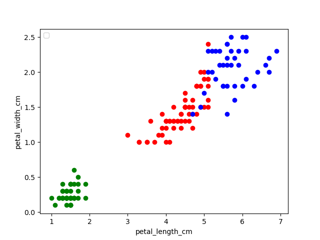

### Homework: 3. Unsupervised Learning
### 520030910185 刘军腾

#### Problem 1
i) calculate the Pearson linear correlation between the housing price and each of the features;

* The formulation of Pearson linear correlation:
$$ \rho(X,Y)=\frac{E[(X-\mu_X)(Y-\mu_Y)]}{\sigma_X \sigma_Y}$$

* The result we get
  [-0.38753720817458476, 0.35973299987653184, -0.4827691814512416, 0.1749138132037553, -0.4264762649179988, 0.6939857179271287, -0.37620959550853944, 0.2494348037813863, -0.38087202860293995, -0.46760997322474696, -0.5067831545384744, 0.33280180617948335, -0.7362048946993625]

ii)use PCA to find the principal components; 
* We first centralize the $X$ data.
* Get the covariance matrix $C=\frac{X^TX}{n-1}$
* Get eigenvalue and eigenvector using `np.linalg.eig`.
* Sort according to eigenvalue to get the principal.

Our programming results (eigenvalue and eigenvector)are shown below.
1299950.4322263112
[ 2.92973218e-02  6.66847277e-03  1.14793645e-02  2.71309632e-02
  9.52338065e-01 -1.69050862e-01 -2.16220534e-01 -1.24410586e-01
  1.37713177e-02  1.66179883e-02  1.99666297e-03  1.99499182e-03
 -5.12974614e-04]
263034.72341708734
[-4.35898000e-02  1.17564821e-03 -6.32897481e-01  7.68058991e-01
 -5.67213995e-03  4.68215380e-02 -3.51598379e-02  5.13731838e-02
  2.35075239e-02 -3.06891846e-02 -5.51190327e-03 -1.93735139e-04
 -1.27249747e-04]
34439.48324919539
[ 0.02833094 -0.00494976  0.08834036 -0.01280072 -0.05710486  0.34365159
 -0.78594868  0.49077655  0.03529932  0.09809143  0.01785449 -0.00811847
  0.00424115]
11222.986918985207
[-5.55846350e-05 -1.02678850e-04  9.75320360e-04  8.54389584e-04
 -2.16905859e-03 -3.50007555e-03 -5.10632892e-03  1.13540624e-02
 -1.78071403e-02 -1.57944414e-03  1.59115209e-02  9.99595031e-01
  7.96040929e-03]
2097.0767838581155
[ 4.49721818e-04  1.82069867e-06  1.80720215e-03  6.79655226e-04
 -1.65862374e-04  1.88005073e-03 -3.87411008e-03  4.43586112e-03
 -1.38982123e-02 -1.06145120e-02 -1.15304965e-02  7.81438643e-03
 -9.99728952e-01]
1173.1483883931105
[-1.16815860e-03  3.65750108e-04 -4.73397110e-03  5.70127889e-03
 -1.32805158e-02 -7.26727686e-02 -8.19422836e-03  1.49295805e-02
 -5.29376229e-02 -5.10088246e-02  9.94176118e-01 -1.72613654e-02
 -1.03655286e-02]
676.0008225347333
[ 0.08363357 -0.00572247  0.75586307  0.63660864 -0.04630508 -0.10943336
  0.02633499 -0.01762333  0.02318733  0.02606568 -0.00552133 -0.00089168
  0.00091602]
400.94128660908603
[-6.56163360e-03  3.53685109e-04 -4.50884160e-02  2.57418757e-03
 -6.53874230e-03  7.31403889e-03  8.92882113e-02 -6.53956452e-02
  2.24514085e-01  9.64832558e-01  6.33344798e-02  5.88523978e-03
 -1.47537062e-02]
137.7527152149064
[ 0.04500538 -0.00861866 -0.00284787 -0.0195602   0.1722788  -0.20939346
  0.43235109  0.85435954 -0.07038692  0.03892452 -0.02399225 -0.00866415
  0.00246908]
49.69796786122025
[ 9.49741169e-01 -2.92406308e-01 -9.38644477e-02 -1.99794164e-02
 -3.27034769e-02 -3.26058676e-03 -2.54943754e-03 -4.67832040e-02
 -2.03291846e-03 -4.78693899e-04  7.74410529e-04  5.17544251e-04
  7.34929155e-05]
10.737804153547776
[ 0.00560012 -0.00252899  0.01115926 -0.0320108   0.0218373   0.04101249
  0.07125742  0.06002311  0.96585995 -0.22989105  0.04301698  0.01613785
 -0.0112919 ]
2.529143289862344
[-2.91218514e-01 -9.56180551e-01  2.35628231e-02  4.03696433e-03
  1.70162101e-02  5.86081231e-03  1.28815498e-03  3.07792458e-03
 -1.89391271e-03  2.10866955e-05  6.15754716e-04 -1.54876273e-04
 -5.27489825e-05]
0.12854172051528656
[ 0.02294338  0.0057672   0.0928333   0.04529661  0.23637921  0.88782557
  0.36538985 -0.01820415 -0.07685929 -0.0222822   0.06637588  0.00309935
  0.00090636]

iii)calculate the Pearson linear correlation between the housing price and the first three principle components.
* On the basis of ii), we can select three eigenvectors with the largest three eigenvalues.
* Multiply with X to get the first three prinicipal components.
* Calculate the Pearson linear correlation according to i)

Our programming results are shown below.
[0.14197357213562214, 0.5265379772060793, 0.009191510152871209]

#### Problem 2

Implement K-means clustering method on the data set “fisheriris” (matlab build-in dataset). Try different strategies and then use the label to measure the clustering accuracy.

Basic idea of the algorithm:
* We first select k points randomly as the center points.
* Iterate all points to find which center point(cluster) is closest to it and record it.
* Re-calculate the center point using the mean value of points belong to the cluster.(We use L2 distance)
* We end the process when all center points don't change.

How to calculate the accuracy?
* Just like decision tree, we can calculate every cluster's accuracy $\frac{correct}{all}$.

* However, we can know that if we choose enough large k, the number of points in every cluster are small,then we can get larger cluster accuracy. At this time, the accuracy is not a good standard to measure the algorithm.  

Results of k=3:
* We get three centers: [5.88360656, 2.74098361, 4.38852459, 1.43442623] [5.006, 3.418, 1.464, 0.244] [6.85384615, 3.07692308, 5.71538462, 2.05384615]
* Frist cluster we have  47 Iris-versicolor, 14 Iris-virginica, we calculate the accuracy $\frac{47}{47+14}=0.77$
* Second cluster we have 50 Iris-setosa, the accuracy is $1$
* Third cluster we have 3 Iris-versicolor, and 36 Iris-virginica, we can calculate the accuracy $\frac{36}{36+3}=0.92$
* The overall accuracy is $\frac{47+50+36}{47+14+50+36+3}=0.887$
* Conclusion: we can see that we get a good accuracy.
* Visualization:

Result of K=2:

Result of k=4:

Result of k=5:

